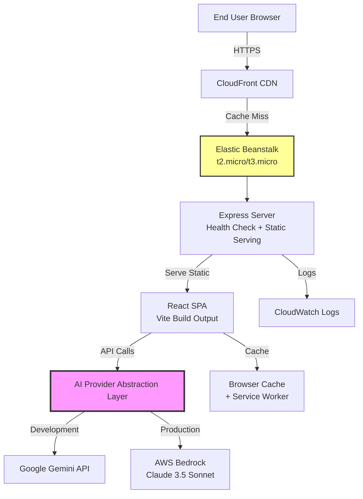
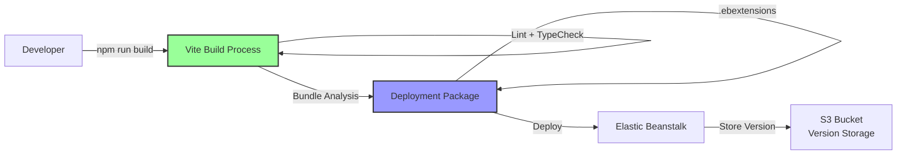

# Design Document: AWS Elastic Beanstalk Optimization

## Overview

This design document specifies the architecture and implementation approach for optimizing a React productivity copilot web application for deployment on AWS Elastic Beanstalk within AWS Free Tier constraints. The application is built with React, TypeScript, Vite, Framer Motion, and Tailwind CSS, and integrates with AI services through a hybrid provider system supporting both Google Gemini and AWS Bedrock.

### Goals

1. Optimize build configuration for minimal bundle size and fast load times
2. Implement production-ready deployment configuration for AWS Elastic Beanstalk
3. Ensure cost efficiency within AWS Free Tier limits
4. Provide a flexible AI provider abstraction layer supporting multiple backends
5. Implement comprehensive monitoring, logging, and error handling
6. Ensure security best practices for production deployment

### Non-Goals

1. Migrating away from the current React/Vite/TypeScript stack
2. Implementing server-side rendering or Next.js migration
3. Building a custom AI model or training infrastructure
4. Supporting multiple cloud providers beyond AWS
5. Implementing user authentication or multi-tenancy

### Key Design Decisions

1. **Hybrid AI Provider Architecture**: Implement an abstraction layer that allows switching between Google Gemini (development/free tier) and AWS Bedrock (production/AWS-native) without code changes
2. **Static Site Deployment**: Deploy as a static React SPA with client-side routing, served through Elastic Beanstalk with Node.js runtime
3. **Build-Time Optimization**: Leverage Vite's build optimizations including tree-shaking, code splitting, and asset optimization
4. **Client-Side Caching**: Implement aggressive caching strategies for API responses and static assets to minimize costs
5. **Health Check Endpoint**: Create a lightweight Express server to handle Elastic Beanstalk health checks while serving the static React app


## Architecture

### High-Level Architecture



### Deployment Architecture



### Component Architecture

The application consists of the following major components:

1. **Build System Layer**: Vite configuration with optimization plugins
2. **Server Layer**: Lightweight Express server for health checks and static file serving
3. **Client Application Layer**: React SPA with lazy-loaded routes and components
4. **AI Provider Abstraction Layer**: Interface-based system for swapping AI backends
5. **Caching Layer**: Multi-level caching (browser, service worker, API response cache)
6. **Monitoring Layer**: Web Vitals tracking, error boundaries, CloudWatch integration


## Components and Interfaces

### 1. Build System Component

**Purpose**: Optimize the production build for minimal size and maximum performance.

**Implementation**:
- Vite configuration file (`vite.config.ts`) with production optimizations
- Rollup plugins for bundle analysis and compression
- Asset optimization pipeline for images and fonts

**Key Configuration**:
```typescript
// vite.config.ts structure
{
  build: {
    target: 'es2015',
    minify: 'terser',
    sourcemap: true,
    rollupOptions: {
      output: {
        manualChunks: {
          'vendor': ['react', 'react-dom'],
          'motion': ['framer-motion'],
          'markdown': ['react-markdown']
        }
      }
    },
    chunkSizeWarningLimit: 500
  },
  plugins: [
    compression({ algorithm: 'gzip' }),
    compression({ algorithm: 'brotli' }),
    imageOptimizer(),
    bundleAnalyzer()
  ]
}
```

**Outputs**:
- Minified JavaScript bundles with content hashing
- Optimized CSS with unused styles removed
- Compressed static assets (gzip + brotli)
- Bundle analysis report (JSON + HTML)
- Source maps for production debugging


### 2. Express Server Component

**Purpose**: Provide health check endpoint for Elastic Beanstalk and serve static React application.

**Interface**:
```typescript
interface HealthCheckResponse {
  status: 'healthy' | 'unhealthy';
  timestamp: string;
  version: string;
  checks?: {
    memory: boolean;
    disk: boolean;
  };
}

interface ServerConfig {
  port: number;
  staticDir: string;
  healthCheckPath: string;
  enableCompression: boolean;
}
```

**Implementation Details**:
- Express.js server with minimal dependencies
- Compression middleware for gzip/brotli
- Static file serving with cache headers
- Health check endpoint with system checks
- Request logging middleware
- Error handling middleware

**File Structure**:
```
server/
  ├── index.ts          # Main server entry point
  ├── health.ts         # Health check logic
  ├── middleware.ts     # Compression, logging, security headers
  └── config.ts         # Server configuration
```


### 3. AI Provider Abstraction Layer

**Purpose**: Provide a unified interface for AI operations that supports multiple backend providers (Gemini, Bedrock) without changing application code.

**Core Interface**:
```typescript
interface AIProvider {
  readonly name: string;
  readonly supportsStreaming: boolean;
  
  generateOptimization(request: OptimizationRequest): Promise<OptimizationResponse>;
  validateCredentials(): Promise<boolean>;
  getUsageMetrics(): UsageMetrics;
}

interface OptimizationRequest {
  prompt: string;
  context: string;
  maxTokens?: number;
  temperature?: number;
}

interface OptimizationResponse {
  content: string;
  tokensUsed: {
    input: number;
    output: number;
  };
  provider: string;
  latencyMs: number;
}

interface UsageMetrics {
  totalRequests: number;
  totalTokensInput: number;
  totalTokensOutput: number;
  estimatedCost: number;
  errors: number;
}

interface ProviderConfig {
  type: 'gemini' | 'bedrock';
  apiKey?: string;
  region?: string;
  modelId?: string;
  retryConfig: RetryConfig;
  rateLimitConfig: RateLimitConfig;
}

interface RetryConfig {
  maxRetries: number;
  initialDelayMs: number;
  maxDelayMs: number;
  backoffMultiplier: number;
}

interface RateLimitConfig {
  maxRequestsPerMinute: number;
  maxTokensPerMinute: number;
}
```


**Provider Implementations**:

```typescript
// Gemini Provider Implementation
class GeminiProvider implements AIProvider {
  readonly name = 'gemini';
  readonly supportsStreaming = true;
  
  private apiKey: string;
  private client: GoogleGenerativeAI;
  private metrics: UsageMetrics;
  
  constructor(config: ProviderConfig) {
    // Initialize Gemini client
  }
  
  async generateOptimization(request: OptimizationRequest): Promise<OptimizationResponse> {
    // Transform request to Gemini format
    // Call Gemini API
    // Transform response to standard format
    // Update metrics
  }
  
  async validateCredentials(): Promise<boolean> {
    // Test API key validity
  }
  
  getUsageMetrics(): UsageMetrics {
    return this.metrics;
  }
}

// Bedrock Provider Implementation
class BedrockProvider implements AIProvider {
  readonly name = 'bedrock';
  readonly supportsStreaming = true;
  
  private client: BedrockRuntimeClient;
  private modelId = 'anthropic.claude-3-5-sonnet-20241022-v2:0';
  private metrics: UsageMetrics;
  
  constructor(config: ProviderConfig) {
    // Initialize Bedrock client with AWS credentials
  }
  
  async generateOptimization(request: OptimizationRequest): Promise<OptimizationResponse> {
    // Transform request to Claude format
    // Call Bedrock API
    // Transform response to standard format
    // Update metrics and calculate cost
  }
  
  async validateCredentials(): Promise<boolean> {
    // Test AWS credentials and Bedrock access
  }
  
  getUsageMetrics(): UsageMetrics {
    return this.metrics;
  }
}
```


**Provider Factory**:
```typescript
class AIProviderFactory {
  static create(config: ProviderConfig): AIProvider {
    switch (config.type) {
      case 'gemini':
        return new GeminiProvider(config);
      case 'bedrock':
        return new BedrockProvider(config);
      default:
        throw new Error(`Unknown provider type: ${config.type}`);
    }
  }
  
  static createFromEnvironment(): AIProvider {
    const providerType = process.env.VITE_AI_PROVIDER || 'gemini';
    
    const config: ProviderConfig = {
      type: providerType as 'gemini' | 'bedrock',
      apiKey: process.env.VITE_GEMINI_API_KEY,
      region: process.env.AWS_REGION || 'us-east-1',
      modelId: process.env.VITE_BEDROCK_MODEL_ID,
      retryConfig: {
        maxRetries: 3,
        initialDelayMs: 1000,
        maxDelayMs: 10000,
        backoffMultiplier: 2
      },
      rateLimitConfig: {
        maxRequestsPerMinute: 60,
        maxTokensPerMinute: 100000
      }
    };
    
    return AIProviderFactory.create(config);
  }
}
```

**File Structure**:
```
src/services/ai/
  ├── types.ts              # Interface definitions
  ├── factory.ts            # Provider factory
  ├── gemini-provider.ts    # Gemini implementation
  ├── bedrock-provider.ts   # Bedrock implementation
  ├── cache.ts              # Response caching logic
  └── metrics.ts            # Usage tracking
```


### 4. Caching Component

**Purpose**: Implement multi-level caching to minimize API calls and improve performance.

**Cache Layers**:

1. **API Response Cache** (In-Memory + LocalStorage)
```typescript
interface CacheEntry<T> {
  data: T;
  timestamp: number;
  expiresAt: number;
  key: string;
}

interface CacheConfig {
  ttlMs: number;
  maxEntries: number;
  storageType: 'memory' | 'localStorage' | 'both';
}

class APICache<T> {
  private memoryCache: Map<string, CacheEntry<T>>;
  private config: CacheConfig;
  
  set(key: string, data: T): void;
  get(key: string): T | null;
  has(key: string): boolean;
  invalidate(key: string): void;
  clear(): void;
  prune(): void; // Remove expired entries
}
```

2. **Service Worker Cache** (Static Assets)
```typescript
// Service worker caching strategy
const CACHE_NAME = 'productivity-copilot-v1';
const STATIC_ASSETS = [
  '/',
  '/index.html',
  '/assets/index.js',
  '/assets/index.css'
];

// Cache-first strategy for static assets
// Network-first strategy for API calls
```

3. **HTTP Cache Headers** (CDN + Browser)
```typescript
interface CacheHeaders {
  'Cache-Control': string;
  'ETag': string;
  'Last-Modified': string;
}

// Hashed assets: max-age=31536000 (1 year)
// HTML: no-cache, must-revalidate
// API responses: no-store
```


### 5. Code Splitting and Lazy Loading Component

**Purpose**: Reduce initial bundle size by splitting code and loading on demand.

**Implementation Strategy**:

```typescript
// Route-based code splitting
const StrategiesView = lazy(() => import('./views/StrategiesView'));
const OptimizerView = lazy(() => import('./views/OptimizerView'));

// Component-based lazy loading
const FramerMotionComponents = lazy(() => import('./components/AnimatedComponents'));
const ReactMarkdown = lazy(() => import('react-markdown'));

// Lazy loading wrapper with suspense
function LazyRoute({ component: Component, fallback }: LazyRouteProps) {
  return (
    <Suspense fallback={fallback || <LoadingSpinner />}>
      <Component />
    </Suspense>
  );
}
```

**Bundle Structure**:
```
dist/
  ├── index.html
  ├── assets/
      ├── index-[hash].js          # Main bundle (~100KB)
      ├── vendor-[hash].js         # React + React DOM (~130KB)
      ├── motion-[hash].js         # Framer Motion (~80KB)
      ├── markdown-[hash].js       # React Markdown (~40KB)
      ├── strategies-[hash].js     # Strategies view (~30KB)
      ├── optimizer-[hash].js      # Optimizer view (~30KB)
      └── index-[hash].css         # Styles (~20KB)
```

**Loading Strategy**:
- Initial load: index.js + vendor.js + index.css (~250KB gzipped)
- On-demand: Route-specific chunks loaded when navigating
- Preload: Critical chunks preloaded with `<link rel="preload">`


### 6. Monitoring and Logging Component

**Purpose**: Track performance metrics, errors, and usage for debugging and optimization.

**Interfaces**:
```typescript
interface WebVitalsMetrics {
  LCP: number;  // Largest Contentful Paint
  FID: number;  // First Input Delay
  CLS: number;  // Cumulative Layout Shift
  TTFB: number; // Time to First Byte
  FCP: number;  // First Contentful Paint
}

interface PerformanceMetrics {
  pageLoadTime: number;
  timeToInteractive: number;
  apiResponseTime: number;
  bundleSize: number;
  cacheHitRate: number;
}

interface ErrorLog {
  timestamp: string;
  level: 'info' | 'warn' | 'error';
  message: string;
  stack?: string;
  context?: Record<string, any>;
  provider?: string;
}

interface Logger {
  info(message: string, context?: Record<string, any>): void;
  warn(message: string, context?: Record<string, any>): void;
  error(message: string, error?: Error, context?: Record<string, any>): void;
  flush(): Promise<void>; // Send logs to CloudWatch
}
```

**Implementation**:
- Web Vitals library integration for Core Web Vitals tracking
- Custom performance observer for API timing
- Error boundary components for React error catching
- Structured logging with severity levels
- CloudWatch Logs integration for production


### 7. Security Component

**Purpose**: Implement security best practices for production deployment.

**Security Headers**:
```typescript
interface SecurityHeaders {
  'Content-Security-Policy': string;
  'X-Content-Type-Options': 'nosniff';
  'X-Frame-Options': 'DENY';
  'X-XSS-Protection': '1; mode=block';
  'Strict-Transport-Security': 'max-age=31536000; includeSubDomains';
  'Referrer-Policy': 'strict-origin-when-cross-origin';
}

const CSP_POLICY = [
  "default-src 'self'",
  "script-src 'self' 'unsafe-inline'", // Vite requires unsafe-inline in dev
  "style-src 'self' 'unsafe-inline'",
  "img-src 'self' data: https:",
  "font-src 'self' data:",
  "connect-src 'self' https://generativelanguage.googleapis.com https://bedrock-runtime.*.amazonaws.com",
  "frame-ancestors 'none'",
  "base-uri 'self'",
  "form-action 'self'"
].join('; ');
```

**Input Sanitization**:
```typescript
interface Sanitizer {
  sanitizeHTML(input: string): string;
  sanitizePrompt(input: string): string;
  validateEnvironmentVariables(): ValidationResult;
}
```

**Rate Limiting**:
```typescript
interface RateLimiter {
  checkLimit(key: string): boolean;
  recordRequest(key: string): void;
  reset(key: string): void;
}

// Token bucket algorithm for API rate limiting
class TokenBucketRateLimiter implements RateLimiter {
  private buckets: Map<string, TokenBucket>;
  private maxTokens: number;
  private refillRate: number;
}
```


### 8. Deployment Configuration Component

**Purpose**: Automate deployment to Elastic Beanstalk with proper configuration.

**File Structure**:
```
.ebextensions/
  ├── 01_nodejs.config        # Node.js runtime configuration
  ├── 02_environment.config   # Environment variables
  ├── 03_https.config         # HTTPS redirect
  └── 04_cloudwatch.config    # CloudWatch Logs configuration

.platform/
  ├── hooks/
      ├── prebuild/
      │   └── 01_install_deps.sh
      └── postdeploy/
          └── 01_verify_health.sh

deployment/
  ├── deploy.sh               # Deployment script
  ├── rollback.sh             # Rollback script
  └── version.json            # Version metadata
```

**Elastic Beanstalk Configuration**:
```yaml
# .ebextensions/01_nodejs.config
option_settings:
  aws:elasticbeanstalk:container:nodejs:
    NodeCommand: "node server/index.js"
    NodeVersion: "18"
  aws:elasticbeanstalk:application:environment:
    NODE_ENV: "production"
    PORT: "8080"
  aws:autoscaling:launchconfiguration:
    InstanceType: t3.micro
    IamInstanceProfile: aws-elasticbeanstalk-ec2-role
  aws:elasticbeanstalk:environment:
    EnvironmentType: SingleInstance
    ServiceRole: aws-elasticbeanstalk-service-role
  aws:elasticbeanstalk:healthreporting:system:
    SystemType: enhanced
  aws:elasticbeanstalk:application:
    Application Healthcheck URL: /health
```


## Data Models

### Configuration Models

```typescript
// Application configuration
interface AppConfig {
  version: string;
  environment: 'development' | 'production';
  aiProvider: AIProviderConfig;
  cache: CacheConfig;
  monitoring: MonitoringConfig;
  security: SecurityConfig;
}

interface AIProviderConfig {
  type: 'gemini' | 'bedrock';
  credentials: {
    geminiApiKey?: string;
    awsRegion?: string;
    awsAccessKeyId?: string;
    awsSecretAccessKey?: string;
  };
  modelConfig: {
    temperature: number;
    maxTokens: number;
    topP?: number;
  };
  retry: RetryConfig;
  rateLimit: RateLimitConfig;
}

interface MonitoringConfig {
  enableWebVitals: boolean;
  enablePerformanceTracking: boolean;
  enableErrorTracking: boolean;
  cloudWatchLogGroup?: string;
  sampleRate: number; // 0.0 to 1.0
}

interface SecurityConfig {
  enableCSP: boolean;
  enableRateLimiting: boolean;
  maxRequestsPerMinute: number;
  enableInputSanitization: boolean;
}
```


### Request/Response Models

```typescript
// AI optimization request/response
interface OptimizationRequest {
  prompt: string;
  context: string;
  maxTokens?: number;
  temperature?: number;
  userId?: string; // For rate limiting
}

interface OptimizationResponse {
  content: string;
  tokensUsed: {
    input: number;
    output: number;
  };
  provider: string;
  latencyMs: number;
  cached: boolean;
  cost?: number; // For Bedrock
}

// Health check models
interface HealthCheckResponse {
  status: 'healthy' | 'unhealthy';
  timestamp: string;
  version: string;
  checks: {
    memory: HealthCheckResult;
    disk: HealthCheckResult;
    aiProvider: HealthCheckResult;
  };
}

interface HealthCheckResult {
  status: 'pass' | 'fail';
  message?: string;
  value?: number;
  threshold?: number;
}

// Deployment models
interface DeploymentManifest {
  version: string;
  buildTimestamp: string;
  gitCommit: string;
  bundleSizes: {
    [key: string]: number;
  };
  environment: string;
  aiProvider: string;
}
```


### Metrics and Logging Models

```typescript
// Performance metrics
interface PerformanceSnapshot {
  timestamp: string;
  metrics: {
    webVitals: WebVitalsMetrics;
    bundleSize: number;
    cacheHitRate: number;
    apiLatency: {
      p50: number;
      p95: number;
      p99: number;
    };
  };
}

// Usage tracking
interface UsageMetrics {
  totalRequests: number;
  totalTokensInput: number;
  totalTokensOutput: number;
  estimatedCost: number;
  errors: number;
  cacheHits: number;
  cacheMisses: number;
  averageLatencyMs: number;
}

// Error tracking
interface ErrorEvent {
  id: string;
  timestamp: string;
  level: 'warn' | 'error' | 'fatal';
  message: string;
  stack?: string;
  context: {
    component?: string;
    provider?: string;
    userId?: string;
    url?: string;
    userAgent?: string;
  };
  resolved: boolean;
}

// CloudWatch log entry
interface CloudWatchLogEntry {
  timestamp: number;
  message: string;
  level: string;
  metadata: Record<string, any>;
}
```


## Error Handling

### Error Handling Strategy

The application implements a comprehensive error handling strategy across all layers to ensure graceful degradation and clear error reporting.

### Error Categories

1. **Build-Time Errors**
   - Bundle size exceeds limits
   - Type checking failures
   - Linting violations
   - Missing environment variables

2. **Runtime Errors**
   - AI provider API failures
   - Network connectivity issues
   - Invalid user input
   - Resource exhaustion (memory, disk)

3. **Deployment Errors**
   - Health check failures
   - Configuration errors
   - Credential validation failures

### Error Handling Implementation

#### 1. React Error Boundaries

```typescript
interface ErrorBoundaryState {
  hasError: boolean;
  error: Error | null;
  errorInfo: React.ErrorInfo | null;
}

class AppErrorBoundary extends React.Component<Props, ErrorBoundaryState> {
  componentDidCatch(error: Error, errorInfo: React.ErrorInfo) {
    // Log error to monitoring service
    logger.error('React error boundary caught error', error, {
      componentStack: errorInfo.componentStack
    });
    
    // Update state to show fallback UI
    this.setState({ hasError: true, error, errorInfo });
  }
  
  render() {
    if (this.state.hasError) {
      return <ErrorFallbackUI error={this.state.error} />;
    }
    return this.props.children;
  }
}
```

#### 2. AI Provider Error Handling

```typescript
class AIProviderErrorHandler {
  async handleProviderError(error: unknown, provider: string): Promise<OptimizationResponse> {
    // Classify error type
    const errorType = this.classifyError(error);
    
    // Log with provider context
    logger.error(`AI provider error: ${provider}`, error as Error, {
      provider,
      errorType,
      timestamp: new Date().toISOString()
    });
    
    // Return standardized error response
    return {
      content: this.getUserFriendlyMessage(errorType),
      tokensUsed: { input: 0, output: 0 },
      provider,
      latencyMs: 0,
      cached: false,
      error: true,
      errorType
    };
  }
  
  private classifyError(error: unknown): ErrorType {
    if (error instanceof NetworkError) return 'network';
    if (error instanceof AuthenticationError) return 'authentication';
    if (error instanceof RateLimitError) return 'rate_limit';
    if (error instanceof TimeoutError) return 'timeout';
    return 'unknown';
  }
  
  private getUserFriendlyMessage(errorType: ErrorType): string {
    const messages = {
      network: 'Unable to connect to AI service. Please check your internet connection.',
      authentication: 'Authentication failed. Please check your API credentials.',
      rate_limit: 'Rate limit exceeded. Please try again in a few moments.',
      timeout: 'Request timed out. Please try again.',
      unknown: 'An unexpected error occurred. Please try again.'
    };
    return messages[errorType];
  }
}
```

#### 3. Retry Logic with Exponential Backoff

```typescript
class RetryHandler {
  async executeWithRetry<T>(
    operation: () => Promise<T>,
    config: RetryConfig
  ): Promise<T> {
    let lastError: Error;
    let delay = config.initialDelayMs;
    
    for (let attempt = 0; attempt <= config.maxRetries; attempt++) {
      try {
        return await operation();
      } catch (error) {
        lastError = error as Error;
        
        // Don't retry on authentication errors
        if (this.isNonRetryableError(error)) {
          throw error;
        }
        
        // Last attempt, throw error
        if (attempt === config.maxRetries) {
          throw lastError;
        }
        
        // Wait before retry
        await this.sleep(delay);
        delay = Math.min(delay * config.backoffMultiplier, config.maxDelayMs);
        
        logger.warn(`Retry attempt ${attempt + 1}/${config.maxRetries}`, {
          delay,
          error: lastError.message
        });
      }
    }
    
    throw lastError!;
  }
  
  private isNonRetryableError(error: unknown): boolean {
    return error instanceof AuthenticationError || 
           error instanceof ValidationError;
  }
  
  private sleep(ms: number): Promise<void> {
    return new Promise(resolve => setTimeout(resolve, ms));
  }
}
```

#### 4. Health Check Error Handling

```typescript
class HealthCheckService {
  async performHealthCheck(): Promise<HealthCheckResponse> {
    const checks = {
      memory: await this.checkMemory(),
      disk: await this.checkDisk(),
      aiProvider: await this.checkAIProvider()
    };
    
    const allHealthy = Object.values(checks).every(check => check.status === 'pass');
    
    return {
      status: allHealthy ? 'healthy' : 'unhealthy',
      timestamp: new Date().toISOString(),
      version: process.env.APP_VERSION || 'unknown',
      checks
    };
  }
  
  private async checkMemory(): Promise<HealthCheckResult> {
    const usage = process.memoryUsage();
    const heapUsedMB = usage.heapUsed / 1024 / 1024;
    const threshold = 400; // MB
    
    return {
      status: heapUsedMB < threshold ? 'pass' : 'fail',
      value: heapUsedMB,
      threshold,
      message: heapUsedMB < threshold ? 'Memory usage normal' : 'Memory usage high'
    };
  }
  
  private async checkAIProvider(): Promise<HealthCheckResult> {
    try {
      const provider = AIProviderFactory.createFromEnvironment();
      const isValid = await provider.validateCredentials();
      
      return {
        status: isValid ? 'pass' : 'fail',
        message: isValid ? 'AI provider accessible' : 'AI provider credentials invalid'
      };
    } catch (error) {
      return {
        status: 'fail',
        message: `AI provider check failed: ${(error as Error).message}`
      };
    }
  }
}
```

#### 5. Build-Time Error Handling

```typescript
// vite.config.ts
export default defineConfig({
  build: {
    rollupOptions: {
      onwarn(warning, warn) {
        // Fail build on circular dependencies
        if (warning.code === 'CIRCULAR_DEPENDENCY') {
          throw new Error(`Circular dependency detected: ${warning.message}`);
        }
        warn(warning);
      }
    }
  },
  plugins: [
    {
      name: 'bundle-size-check',
      closeBundle() {
        const stats = fs.statSync('dist/assets/index.js');
        const sizeKB = stats.size / 1024;
        
        if (sizeKB > 500) {
          throw new Error(
            `Bundle size ${sizeKB.toFixed(2)}KB exceeds limit of 500KB`
          );
        }
      }
    }
  ]
});
```

### Error Logging

All errors are logged with structured data for easy debugging:

```typescript
interface ErrorLogEntry {
  timestamp: string;
  level: 'error' | 'warn';
  message: string;
  error: {
    name: string;
    message: string;
    stack?: string;
  };
  context: {
    component?: string;
    provider?: string;
    userId?: string;
    url?: string;
    userAgent?: string;
  };
}

class Logger {
  error(message: string, error: Error, context?: Record<string, any>): void {
    const entry: ErrorLogEntry = {
      timestamp: new Date().toISOString(),
      level: 'error',
      message,
      error: {
        name: error.name,
        message: error.message,
        stack: error.stack
      },
      context: {
        ...context,
        url: window.location.href,
        userAgent: navigator.userAgent
      }
    };
    
    // Log to console
    console.error(JSON.stringify(entry));
    
    // Send to CloudWatch in production
    if (process.env.NODE_ENV === 'production') {
      this.sendToCloudWatch(entry);
    }
  }
}
```

### User-Facing Error Messages

Error messages shown to users are friendly and actionable:

```typescript
const USER_ERROR_MESSAGES = {
  NETWORK_ERROR: 'Unable to connect. Please check your internet connection and try again.',
  API_ERROR: 'The AI service is temporarily unavailable. Please try again in a moment.',
  RATE_LIMIT: 'Too many requests. Please wait a moment before trying again.',
  INVALID_INPUT: 'Please check your input and try again.',
  TIMEOUT: 'The request took too long. Please try again.',
  UNKNOWN: 'Something went wrong. Please try again or contact support if the problem persists.'
};
```


## Testing Strategy

### Testing Approach

The application uses a dual testing approach combining unit tests for specific scenarios and property-based tests for comprehensive coverage.

### Testing Layers

1. **Unit Tests**: Specific examples, edge cases, integration points
2. **Property-Based Tests**: Universal properties across all inputs
3. **Integration Tests**: Component interactions and API integrations
4. **End-to-End Tests**: Critical user flows

### Unit Testing

**Framework**: Vitest (fast, Vite-native test runner)

**Coverage Targets**:
- Minimum 80% code coverage
- 100% coverage for critical paths (AI provider abstraction, error handling)

**Test Structure**:
```typescript
describe('AIProviderFactory', () => {
  describe('createFromEnvironment', () => {
    it('should create Gemini provider when VITE_AI_PROVIDER is "gemini"', () => {
      process.env.VITE_AI_PROVIDER = 'gemini';
      process.env.VITE_GEMINI_API_KEY = 'test-key';
      
      const provider = AIProviderFactory.createFromEnvironment();
      
      expect(provider.name).toBe('gemini');
    });
    
    it('should create Bedrock provider when VITE_AI_PROVIDER is "bedrock"', () => {
      process.env.VITE_AI_PROVIDER = 'bedrock';
      process.env.AWS_REGION = 'us-east-1';
      
      const provider = AIProviderFactory.createFromEnvironment();
      
      expect(provider.name).toBe('bedrock');
    });
    
    it('should default to Gemini when VITE_AI_PROVIDER is not set', () => {
      delete process.env.VITE_AI_PROVIDER;
      process.env.VITE_GEMINI_API_KEY = 'test-key';
      
      const provider = AIProviderFactory.createFromEnvironment();
      
      expect(provider.name).toBe('gemini');
    });
    
    it('should throw error when Gemini is selected but API key is missing', () => {
      process.env.VITE_AI_PROVIDER = 'gemini';
      delete process.env.VITE_GEMINI_API_KEY;
      
      expect(() => AIProviderFactory.createFromEnvironment()).toThrow(
        'Gemini API key is required'
      );
    });
  });
});

describe('GeminiProvider', () => {
  let provider: GeminiProvider;
  
  beforeEach(() => {
    provider = new GeminiProvider({
      type: 'gemini',
      apiKey: 'test-key',
      retryConfig: { maxRetries: 3, initialDelayMs: 100, maxDelayMs: 1000, backoffMultiplier: 2 },
      rateLimitConfig: { maxRequestsPerMinute: 60, maxTokensPerMinute: 100000 }
    });
  });
  
  it('should transform request to Gemini format', async () => {
    const request: OptimizationRequest = {
      prompt: 'Optimize my workflow',
      context: 'I am a developer',
      maxTokens: 1000,
      temperature: 0.7
    };
    
    // Mock Gemini API call
    const mockResponse = { /* ... */ };
    jest.spyOn(provider['client'], 'generateContent').mockResolvedValue(mockResponse);
    
    const response = await provider.generateOptimization(request);
    
    expect(response.provider).toBe('gemini');
    expect(response.content).toBeDefined();
  });
  
  it('should handle API errors gracefully', async () => {
    const request: OptimizationRequest = {
      prompt: 'Test',
      context: 'Test'
    };
    
    jest.spyOn(provider['client'], 'generateContent').mockRejectedValue(
      new Error('API Error')
    );
    
    await expect(provider.generateOptimization(request)).rejects.toThrow();
  });
});

describe('APICache', () => {
  let cache: APICache<string>;
  
  beforeEach(() => {
    cache = new APICache<string>({
      ttlMs: 3600000,
      maxEntries: 100,
      storageType: 'memory'
    });
  });
  
  it('should store and retrieve cached values', () => {
    cache.set('key1', 'value1');
    expect(cache.get('key1')).toBe('value1');
  });
  
  it('should return null for expired entries', async () => {
    const shortTTLCache = new APICache<string>({
      ttlMs: 100,
      maxEntries: 100,
      storageType: 'memory'
    });
    
    shortTTLCache.set('key1', 'value1');
    await new Promise(resolve => setTimeout(resolve, 150));
    
    expect(shortTTLCache.get('key1')).toBeNull();
  });
  
  it('should respect max entries limit', () => {
    const smallCache = new APICache<string>({
      ttlMs: 3600000,
      maxEntries: 2,
      storageType: 'memory'
    });
    
    smallCache.set('key1', 'value1');
    smallCache.set('key2', 'value2');
    smallCache.set('key3', 'value3');
    
    // Oldest entry should be evicted
    expect(smallCache.has('key1')).toBe(false);
    expect(smallCache.has('key3')).toBe(true);
  });
});

describe('HealthCheckService', () => {
  let service: HealthCheckService;
  
  beforeEach(() => {
    service = new HealthCheckService();
  });
  
  it('should return healthy status when all checks pass', async () => {
    const response = await service.performHealthCheck();
    
    expect(response.status).toBe('healthy');
    expect(response.checks.memory.status).toBe('pass');
  });
  
  it('should return unhealthy status when memory exceeds threshold', async () => {
    // Mock high memory usage
    jest.spyOn(process, 'memoryUsage').mockReturnValue({
      heapUsed: 500 * 1024 * 1024, // 500MB
      heapTotal: 0,
      external: 0,
      rss: 0,
      arrayBuffers: 0
    });
    
    const response = await service.performHealthCheck();
    
    expect(response.checks.memory.status).toBe('fail');
  });
});
```

### Property-Based Testing

**Framework**: fast-check (property-based testing library for TypeScript)

**Configuration**: Minimum 100 iterations per property test

**Property Test Examples**:

```typescript
import fc from 'fast-check';

describe('Property-Based Tests', () => {
  // Property tests will be written based on correctness properties
  // defined in the next section
  
  it('should handle any valid optimization request', () => {
    fc.assert(
      fc.asyncProperty(
        fc.record({
          prompt: fc.string({ minLength: 1, maxLength: 1000 }),
          context: fc.string({ maxLength: 2000 }),
          maxTokens: fc.integer({ min: 100, max: 4000 }),
          temperature: fc.float({ min: 0, max: 1 })
        }),
        async (request) => {
          const provider = AIProviderFactory.createFromEnvironment();
          const response = await provider.generateOptimization(request);
          
          // Properties that should always hold
          expect(response.provider).toBeDefined();
          expect(response.tokensUsed.input).toBeGreaterThanOrEqual(0);
          expect(response.tokensUsed.output).toBeGreaterThanOrEqual(0);
          expect(response.latencyMs).toBeGreaterThanOrEqual(0);
        }
      ),
      { numRuns: 100 }
    );
  });
});
```

### Integration Testing

**Focus Areas**:
- AI provider integration with real API calls (using test credentials)
- Cache integration with LocalStorage
- Health check endpoint with Express server
- Build process with actual bundle generation

**Example**:
```typescript
describe('AI Provider Integration', () => {
  it('should successfully call Gemini API with real credentials', async () => {
    const provider = new GeminiProvider({
      type: 'gemini',
      apiKey: process.env.TEST_GEMINI_API_KEY!,
      retryConfig: { maxRetries: 3, initialDelayMs: 1000, maxDelayMs: 5000, backoffMultiplier: 2 },
      rateLimitConfig: { maxRequestsPerMinute: 60, maxTokensPerMinute: 100000 }
    });
    
    const response = await provider.generateOptimization({
      prompt: 'Say hello',
      context: 'Test'
    });
    
    expect(response.content).toBeTruthy();
    expect(response.tokensUsed.input).toBeGreaterThan(0);
  }, 10000); // 10 second timeout
});
```

### End-to-End Testing

**Framework**: Playwright

**Critical User Flows**:
1. Load application → View strategies → Generate optimization
2. Switch between views with lazy loading
3. Handle API errors gracefully
4. Cache and retrieve optimization results

**Example**:
```typescript
test('should generate optimization and display results', async ({ page }) => {
  await page.goto('http://localhost:3000');
  
  // Navigate to optimizer
  await page.click('text=Optimizer');
  
  // Enter prompt
  await page.fill('[data-testid="prompt-input"]', 'Optimize my morning routine');
  
  // Submit
  await page.click('[data-testid="generate-button"]');
  
  // Wait for results
  await page.waitForSelector('[data-testid="optimization-result"]', { timeout: 10000 });
  
  // Verify results displayed
  const result = await page.textContent('[data-testid="optimization-result"]');
  expect(result).toBeTruthy();
});
```

### Performance Testing

**Tools**: Lighthouse CI, Web Vitals

**Performance Budgets**:
- LCP (Largest Contentful Paint): < 2.5s
- FID (First Input Delay): < 100ms
- CLS (Cumulative Layout Shift): < 0.1
- Total Bundle Size (gzipped): < 500KB
- Time to Interactive: < 3.5s

**Automated Performance Checks**:
```typescript
// In CI pipeline
import { playAudit } from 'playwright-lighthouse';

test('should meet performance budgets', async ({ page }) => {
  await page.goto('http://localhost:3000');
  
  await playAudit({
    page,
    thresholds: {
      performance: 90,
      accessibility: 95,
      'best-practices': 90,
      seo: 90
    },
    reports: {
      formats: { html: true, json: true },
      directory: 'lighthouse-reports'
    }
  });
});
```

### Test Organization

```
tests/
  ├── unit/
  │   ├── services/
  │   │   ├── ai/
  │   │   │   ├── factory.test.ts
  │   │   │   ├── gemini-provider.test.ts
  │   │   │   ├── bedrock-provider.test.ts
  │   │   │   └── cache.test.ts
  │   │   └── health.test.ts
  │   ├── components/
  │   └── utils/
  ├── property/
  │   └── correctness.test.ts
  ├── integration/
  │   ├── ai-provider.test.ts
  │   └── health-check.test.ts
  ├── e2e/
  │   ├── user-flows.spec.ts
  │   └── performance.spec.ts
  └── fixtures/
      ├── mock-responses.ts
      └── test-data.ts
```

### CI/CD Testing Pipeline

```yaml
# .github/workflows/test.yml
name: Test Pipeline

on: [push, pull_request]

jobs:
  test:
    runs-on: ubuntu-latest
    steps:
      - uses: actions/checkout@v3
      - uses: actions/setup-node@v3
        with:
          node-version: '18'
      
      - name: Install dependencies
        run: npm ci
      
      - name: Run linting
        run: npm run lint
      
      - name: Run type checking
        run: npm run type-check
      
      - name: Run unit tests
        run: npm run test:unit
      
      - name: Run property-based tests
        run: npm run test:property
      
      - name: Run integration tests
        run: npm run test:integration
        env:
          TEST_GEMINI_API_KEY: ${{ secrets.TEST_GEMINI_API_KEY }}
      
      - name: Build production bundle
        run: npm run build
      
      - name: Run bundle size check
        run: npm run analyze-bundle
      
      - name: Run E2E tests
        run: npm run test:e2e
      
      - name: Upload coverage
        uses: codecov/codecov-action@v3
```

### Test Data Management

**Mock Data**:
- Use factories for generating test data
- Maintain fixtures for consistent test scenarios
- Mock external API calls in unit tests
- Use real API calls in integration tests (with test credentials)

**Example Factory**:
```typescript
class OptimizationRequestFactory {
  static create(overrides?: Partial<OptimizationRequest>): OptimizationRequest {
    return {
      prompt: 'Default prompt',
      context: 'Default context',
      maxTokens: 1000,
      temperature: 0.7,
      ...overrides
    };
  }
  
  static createRandom(): OptimizationRequest {
    return {
      prompt: faker.lorem.sentence(),
      context: faker.lorem.paragraph(),
      maxTokens: faker.number.int({ min: 100, max: 4000 }),
      temperature: faker.number.float({ min: 0, max: 1 })
    };
  }
}
```


## Correctness Properties

A property is a characteristic or behavior that should hold true across all valid executions of a system—essentially, a formal statement about what the system should do. Properties serve as the bridge between human-readable specifications and machine-verifiable correctness guarantees.

### Property 1: Tree-shaking removes unused exports

For any module with unused exports, the final production bundle should not contain code from those unused exports.

**Validates: Requirements 1.2**

### Property 2: Asset filenames contain content hashes

For any static asset file in the production build output, the filename should contain a content hash for cache busting.

**Validates: Requirements 1.6**

### Property 3: Image optimization reduces file size

For any image asset processed by the build system, the output image file size should be at least 30% smaller than the input image file size.

**Validates: Requirements 1.7**

### Property 4: Lazy-loaded components show loading indicators

For any lazy-loaded component, while the component is being fetched, a loading indicator should be displayed to the user.

**Validates: Requirements 2.5**

### Property 5: Sensitive data excluded from client bundle

For any sensitive environment variable (API keys, secrets, credentials), the value should not appear anywhere in the client-side bundle files.

**Validates: Requirements 3.2, 9.4**

### Property 6: Missing required environment variables produce clear errors

For any required environment variable, if it is not set at application startup, the application should fail with a clear error message indicating which variable is missing.

**Validates: Requirements 3.3**

### Property 7: Health check responds quickly

For any health check request to the /health endpoint, the response time should be less than 100ms.

**Validates: Requirements 4.3**

### Property 8: Health check returns 503 when services unavailable

For any health check request, if required services (AI provider, database, etc.) are unavailable, the endpoint should return HTTP status 503.

**Validates: Requirements 4.4**

### Property 9: Hashed assets have long cache headers

For any static asset with a content hash in its filename, the HTTP response should include a Cache-Control header with max-age of 31536000 (1 year).

**Validates: Requirements 5.1, 11.3**

### Property 10: Text assets are compressed

For any text-based static asset (JavaScript, CSS, HTML, JSON), the asset should be served with gzip or brotli compression enabled.

**Validates: Requirements 5.2**

### Property 11: Compression reduces transfer size significantly

For any text-based static asset, when compression is applied, the compressed size should be at least 60% smaller than the uncompressed size.

**Validates: Requirements 5.5**

### Property 12: Identical API requests use cache

For any API request, if an identical request (same prompt and context) is made within the cache TTL period, the second request should return cached data without making a network call.

**Validates: Requirements 7.2, 11.2**

### Property 13: Resource usage is logged

For any significant resource usage event (API call, memory allocation, disk I/O), metrics should be logged with timestamp and resource type.

**Validates: Requirements 7.3**

### Property 14: Request throttling limits API call rate

For any sequence of API requests exceeding the configured rate limit, the throttling mechanism should delay or reject requests to stay within the limit.

**Validates: Requirements 7.4, 9.5, 16.22**

### Property 15: Unhandled errors are logged with stack traces

For any unhandled error that occurs in the application, the error should be logged to the console with a complete stack trace.

**Validates: Requirements 8.1**

### Property 16: Error boundaries prevent application crashes

For any error thrown within a React component tree, the error boundary should catch it and display a fallback UI instead of crashing the entire application.

**Validates: Requirements 8.2**

### Property 17: API failures are logged and shown to users

For any AI provider API call that fails, the error should be logged with provider-specific details and a user-friendly error message should be displayed to the user.

**Validates: Requirements 8.3, 16.9, 16.10**

### Property 18: Log entries have severity levels

For any log entry created by the application, it should include a severity level (info, warn, or error).

**Validates: Requirements 8.5**

### Property 19: User inputs are sanitized

For any user input received by the application (text input, form data, URL parameters), the input should be sanitized before being processed or stored.

**Validates: Requirements 9.3**

### Property 20: API response times are tracked

For any AI provider API call, the response time should be measured and logged for performance monitoring.

**Validates: Requirements 10.4**

### Property 21: Cache invalidation on version deployment

For any cached resource, when a new application version is deployed, the old cached entries should be invalidated and new resources should be fetched.

**Validates: Requirements 11.5**

### Property 22: Interactive elements have minimum touch target size

For any interactive UI element (button, link, input), the touch target size should be at least 44px × 44px to ensure touch-friendly interactions.

**Validates: Requirements 12.3**

### Property 23: Input debouncing prevents excessive API calls

For any sequence of rapid user input events (typing), only the final input value after a debounce delay should trigger an API call, preventing excessive calls during typing.

**Validates: Requirements 14.1**

### Property 24: Loading states shown during API requests

For any AI provider API request, a loading state indicator should be displayed to the user while the request is in progress.

**Validates: Requirements 14.2**

### Property 25: Timeout warnings for slow API requests

For any AI provider API request that takes longer than 5 seconds, a timeout warning should be displayed to the user.

**Validates: Requirements 14.3**

### Property 26: Retry logic with exponential backoff

For any failed AI provider API request that is retryable (network error, timeout, rate limit), the retry mechanism should use exponential backoff with increasing delays between attempts.

**Validates: Requirements 14.4, 16.11**

### Property 27: API responses cached in browser storage

For any successful AI provider API response, the response should be cached in browser storage (localStorage or IndexedDB) with an expiration timestamp.

**Validates: Requirements 14.5**

### Property 28: In-flight requests cancelled on navigation

For any in-flight AI provider API request, if the user navigates away from the current page, the request should be cancelled to avoid unnecessary processing.

**Validates: Requirements 14.6**

### Property 29: Build fails on quality check failures

For any quality check failure (linting error, type error, test failure), the build process should fail and prevent deployment with a clear error message.

**Validates: Requirements 15.4**

### Property 30: Required environment variables are documented

For any environment variable required by the application, it should be documented in the deployment package with its purpose and expected format.

**Validates: Requirements 15.6**

### Property 31: Provider selection based on configuration

For any valid AI provider configuration (environment variable set to "gemini" or "bedrock"), the application should instantiate and use the correct provider implementation.

**Validates: Requirements 16.3**

### Property 32: Provider abstraction ensures consistent response format

For any AI provider (Gemini or Bedrock) and any optimization request, the response format should be identical regardless of which provider is active, with the same fields and structure.

**Validates: Requirements 16.7**

### Property 33: Provider abstraction supports extensibility

For any new AI provider implementation, it should be possible to add it to the system by implementing the AIProvider interface without modifying existing provider code (Gemini or Bedrock implementations).

**Validates: Requirements 16.18**

### Property 34: Provider-specific request formatting

For any AI provider and any optimization request, the request should be transformed into the format required by that provider's API (Gemini format for Gemini, Claude format for Bedrock).

**Validates: Requirements 16.19**

### Property 35: Provider-specific response parsing

For any AI provider and any API response, the response should be parsed from the provider-specific format into the normalized OptimizationResponse format.

**Validates: Requirements 16.20**

### Property 36: Bedrock token usage tracking

For any Bedrock API call, the token usage (input tokens and output tokens) should be tracked, logged, and used to calculate estimated cost.

**Validates: Requirements 16.21**

### Property 37: Provider-specific configuration via environment variables

For any provider-specific configuration option (temperature, maxTokens, topP), the value should be configurable via environment variables and applied to API requests.

**Validates: Requirements 16.23**

### Property 38: Credential validation at startup

For any selected AI provider, if the required credentials for that provider are missing or invalid, the application should fail at startup with a clear error message indicating which credentials are needed.

**Validates: Requirements 16.15, 16.16, 16.17**

